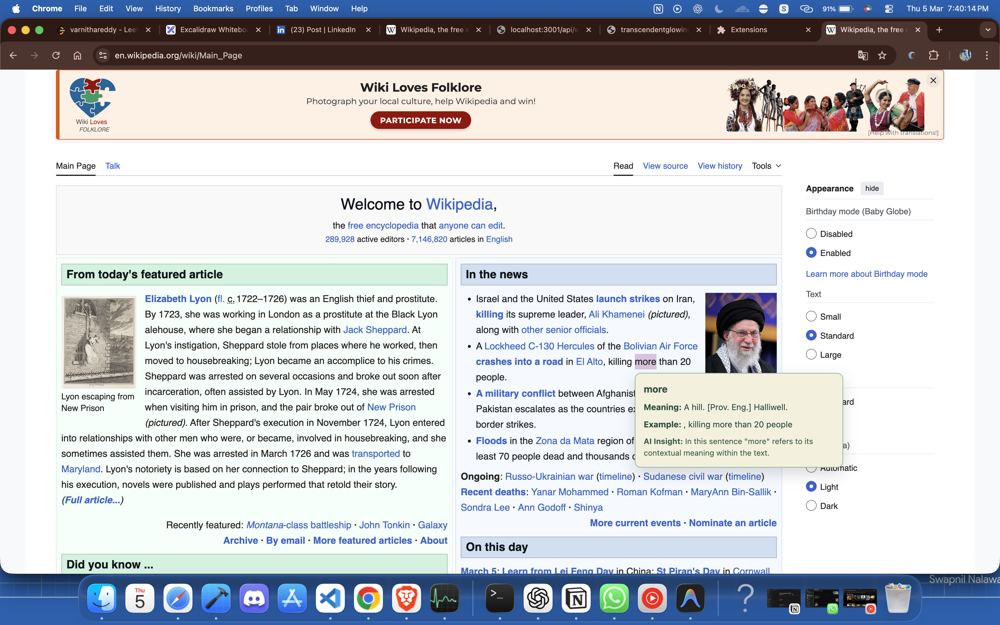

# KAI — AI Context Dictionary Chrome Extension

KAI is a Chrome extension that shows contextual word meanings while reading webpages.

Select any word and KAI instantly displays:

• Meaning  
• Example sentence from the page  
• AI-style contextual insight  

The system uses an offline dictionary containing **86,000+ words** and a Node.js backend.

---

## Screenshot

---

## Features

- Select any word on a webpage
- Instant popup explanation
- 86k word offline dictionary
- Context sentence extraction
- AI-style explanation
- Chrome Extension + Node backend architecture

---

## Tech Stack

- JavaScript
- Node.js
- Express
- Chrome Extensions API

---

## Architecture

Chrome Extension
→ Background Script
→ Node Backend
→ Dictionary Dataset

---

## Dataset

The project uses a dictionary dataset containing **86,000+ English words** for fast offline lookup.

---

## Future Improvements

- Word sense disambiguation
- Better AI contextual explanations
- Fully offline extension version